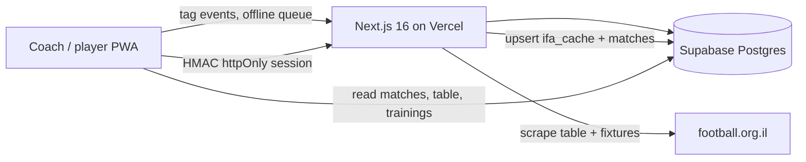

# Oranit Scout

**Live match tagging, season analytics, and club operations — in production with a real Liga Gimel team.**

Hebrew RTL PWA for [Hapoel Oranit](https://www.football.org.il/team-details/?team_id=2735&season_id=28) (ליגה ג׳ שומרון). A coach tags events on the sideline with one thumb; players open the same app to see the next match, the league table, trainings, and their own numbers.

[](https://nextjs.org/)
[](https://react.dev/)
[](https://www.typescriptlang.org/)
[](https://supabase.com/)
[](https://vitest.dev/)
[](https://oranit-stats.vercel.app)

**Live:** [oranit-stats.vercel.app](https://oranit-stats.vercel.app) (club login)

---

## Why this exists

Amateur clubs rarely have Wyscout, a video analyst, or a data intern. What they do have is a coach with a phone on the touchline and a league website with no public API.

This app is the missing layer:

1. **Capture** — tap a player on a formation pitch, tap an action, tap a zone. The event is queued locally first so a dead 4G pitch does not lose data.
2. **Understand** — after the match, Impact Score, zone breakdowns, shot location, minutes, and a video-cut list of defensive turnovers.
3. **Run the club** — scheduled fixtures, countdown to kickoff, IFA league table, calendar with trainings, coach vs player login.

It is not a demo dataset. It is used on match days.

---

## Product

### For the coach

| Surface | What it does |
|---|---|
| **Live tagging** | Formation pitch (4-3-3, 4-4-2, 4-2-3-1, 3-5-2, 5-3-2, 5-4-1). Actions: turnover, recovery, key pass, shot, goal, assist, corners, aerial/ground duels. Zone (def/mid/att) and shot location (in/out of box) when needed. Substitutions, match clock, undo. |
| **Match report** | Per-player Impact Score, zone splits, in-box vs out-of-box shots, CSV export, minutes of defensive turnovers for video. |
| **Season (`נתונים`)** | Sortable squad table, per-90 rates, trend charts, attacking-press metric, season “kings” (goals, assists, tackles, minutes, impact). |
| **Player radar** | Six-axis profile (attack, creation, defense, control, finishing, impact) with a readable explanation of every axis. |
| **Compare** | Overlay up to several players on radar + trends, filtered by league / cup / friendly. |
| **Squad** | Persistent roster; each match stores a snapshot + lineup slots. |
| **Calendar** | Month grid of league fixtures (with opponent crests) and coach-managed **trainings** (date, time, venue). Add / edit / delete. |
| **Home** | Next official IFA fixture, live match entry, countdown. |

### For the player

Login is a different role, not a hidden coach screen.

- Next match + countdown, calendar, league table
- Trainings the coach published
- **Own season profile only** — radar, kings rank, match log  
- Cannot open live tagging, squad admin, or other players’ pages

### IFA integration (no official API)

The Israel Football Association site is scraped server-side (`football.org.il`, team `2735`, season `28`):

- League table and remaining fixtures
- Kickoff time / venue synced onto scheduled matches
- Opponent crests
- Cache in Postgres (`ifa_cache`) so the phone stays fast; refresh about every 10 minutes on production
- Coach can dismiss a fixture; past dismissals stick, future ones do not block a real upcoming game

---

## Architecture



**Auth.** Postgres `verify_login` (pgcrypto) checks the password. The app sets an **httpOnly HMAC-signed cookie** (`scout_session`, 30 days). `proxy.ts` gates routes: players never reach `/live`, `/setup`, `/squad`, or `/season/compare`, and can only open their own `/season/player/...` profile.

**Offline.** Every live event gets a client-generated UUID, is written to `localStorage`, then upserted to `events`. Undo works on both the queue and the server.

**PWA.** `manifest.webmanifest` + service worker (shell cache only — `/api/*` is never cached so table and kickoff stay fresh). Add to Home Screen on iOS/Android.

---

## Tech stack

| Layer | Choice |
|---|---|
| App | Next.js 16 (App Router), React 19, TypeScript |
| UI | Tailwind CSS 4, RTL (`dir="rtl"`), Hebrew fonts, dark/light |
| Charts | Recharts (trends + radar) |
| Data | Supabase (Postgres + JS client) |
| Auth | HMAC sessions, Postgres `crypt` |
| Tests | Vitest — parsing, impact, IFA planning, calendar, rates, auth paths |
| Deploy | Vercel production + GitHub |

Domain logic lives in `lib/` and is unit-tested independently of the UI: Impact weights, playing minutes from substitutions, IFA HTML parse/plan, calendar merge of matches + trainings, player keys across squad snapshots.

---

## Impact Score (coach-tunable)

Weights are a single constant in [`lib/impactScore.ts`](lib/impactScore.ts):

| Action | Default |
|---|---|
| Goal / assist | +2 |
| Recovery (def / mid / att) | +1.5 / +1 / +0.5 |
| Key pass | +1 |
| Shot in box / out of box | +1 / +0.5 |
| Turnover (def / mid / att) | −1.5 / −1 / −0.5 |
| Aerial / ground duel won or lost | ±1 |

Corners are team events (no player). Minutes come from kickoff, substitutions, and full-time.

---

## Resume bullets

Copy or adapt:

- Built and shipped a **production PWA** for a Liga Gimel club: live sideline tagging, season analytics, and player-facing schedules.
- Designed an **offline-first event pipeline** (local UUID queue → Supabase upsert) so tagging survives bad pitch reception.
- Implemented **coach vs player auth** (Postgres password hashing, httpOnly HMAC cookies, route gates).
- Integrated the **Israel FA site without an API** (HTML parse, fixture planning, league table cache, opponent crests).
- Modeled football data: formations, substitutions → minutes, Impact Score, radar percentiles, per-90 rates, CSV / Tableau-oriented export.
- **139 Vitest tests** around the domain layer; deployed on **Vercel + Supabase**.

---

## Project layout

```
app/
  page.tsx                 Home — next match, countdown, live entry
  login/                   Coach / player sign-in
  calendar/                Month calendar + trainings
  table/                   IFA league table + season kings
  squad/                   Roster (coach)
  setup/                   Match setup + lineup
  live/[matchId]/          Sideline tagging + clock
  report/[matchId]/        Post-match report + CSV
  season/                  Season table, trends
  season/player/[key]/     Player radar + match log
  season/compare/          Multi-player compare
  api/login|logout|me      Session
  api/ifa/sync             IFA scrape + cache
lib/                       Domain: impact, IFA, calendar, minutes, export
db/                        schema.sql + migration_v2.sql … v12.sql
public/                    PWA shell, crests, club mark
```

---

## Local setup

**Requirements:** Node 20+, a Supabase project.

1. Create a Supabase project. In **SQL Editor** run [`db/schema.sql`](db/schema.sql) (or, on an existing DB, `migration_v2.sql` … `migration_v12.sql` in order).
2. Create `.env.local`:

```env
NEXT_PUBLIC_SUPABASE_URL=https://YOUR-PROJECT.supabase.co
NEXT_PUBLIC_SUPABASE_ANON_KEY=your-anon-key
AUTH_SECRET=a-long-random-string
```

3. Add users in `app_users` (`coach` or `player`; players need `squad_player_id`):

```sql
insert into public.app_users (username, password, role)
values ('מאמן', 'your-password', 'coach');
```

(`password` is hashed by a trigger; see `db/migration_v9.sql`–`v11.sql`.)

4. Install and run:

```bash
npm install
npm run dev      # http://localhost:3000
npm test
```

The service worker registers only in a production build, not in `next dev`.

### Vercel

Connect the GitHub repo, set the same env vars, deploy. On the phone: open the URL → Share → **Add to Home Screen**.

---

## Hebrew — תקציר למועדון

סקאוט של **הפועל אורנית**: איסוף חי על המגרש, דוח אחרי משחק, טבלת ליגה ולוח שנה מההתאחדות, אימונים שהמאמן מפרסם, וכניסה נפרדת לשחקן (רק הנתונים שלו).

- מאמן: לייב, סגל, נתוני עונה, השוואה, ייצוא.
- שחקן: בית, לוח, טבלה, הפרופיל האישי.
- בלי קליטה במשחק האירועים נשמרים בטלפון ויוצאים כשיש רשת.

---

## License

Private club project. Code in this repository is for portfolio and team use.
